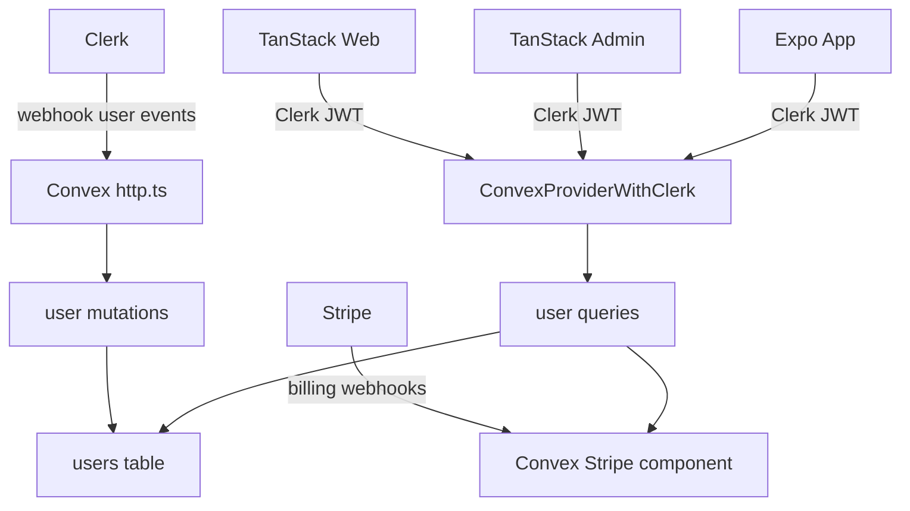

# Auth And Convex Migration Plan

## Recommended Scope

- Migrate core custom auth: email/password sign-in, sign-up, email verification, forgot password, Google OAuth where supported, Clerk error handling, and route navigation.
- Use `react-hook-form` with `zod` validation for custom forms, following the starter repo's form architecture.
- Migrate Convex core auth backend: `users` schema, Clerk webhook sync, authenticated user queries/mutations, device info sync, and terms agreement support.
- Add a new admin app under `legacy-building/apps` as a TanStack Router project with email/password-only sign-in, a protected dashboard page, and a protected settings page.
- Include billing in this pass using the official Convex Stripe component, `@convex-dev/stripe`, rather than copying the starter's custom Stripe tables and webhook implementation.
- Required migration dependencies are installed:
  - [`legacy-building/packages/backend/package.json`](../packages/backend/package.json): `@convex-dev/stripe`, `@clerk/backend`.
  - [`legacy-building/apps/web/package.json`](../apps/web/package.json): `react-hook-form`.
  - [`legacy-building/apps/native/package.json`](../apps/native/package.json): `react-hook-form`, `@hookform/resolvers`.
- Follow the starter repo's Cursor rules now present in `legacy-building/.cursor/rules`, adapting them where project structure differs.
- Adapt for existing targets instead of copying framework-specific files:
  - Web: TanStack Router routes in [`legacy-building/apps/web/src/routes`](../apps/web/src/routes), using `@clerk/react`.
  - Admin: new TanStack Router app under [`legacy-building/apps`](../apps), using `@clerk/react` and the shared Convex backend.
  - Native: Expo Router screens in [`legacy-building/apps/native/app/(auth)`](../apps/native/app/(auth)), using `@clerk/expo`.
  - Backend: Convex modules under [`legacy-building/packages/backend/convex`](../packages/backend/convex).

## Starter Cursor Rules To Follow

- The user copied these rules from `starter-codebase-main/.cursor/rules` into [`legacy-building/.cursor/rules`](rules); implementation should follow them:
  - `ux-patterns.mdc`
  - `ui-styling.mdc`
  - `forms-zod-react-hook-form.mdc`
  - `convex.mdc`
- UX requirements: mobile-first layouts at 375px, `svh` for full-height screens, skeleton loaders for fetched data, loading states on async actions, friendly empty/error states, Sonner toasts for mutation results, and view-transition-aware navigation where practical.
- Styling requirements: compose shadcn primitives instead of forking them, use shared CSS variable tokens such as `bg-background`, `text-foreground`, `border-border`, and include hover, active, and focus feedback on all interactive elements.
- Form requirements: use `react-hook-form`, `zod`, and `@hookform/resolvers/zod`; reusable schemas live in `lib/**/schemas.ts` or colocated `*.schema.ts`; field errors come from `form.formState.errors`; inputs set `aria-invalid` when invalid.
- Convex requirements: group backend functions by domain with separate `queries.ts`, `mutations.ts`, and `actions.ts`; prefer official Convex components such as `@convex-dev/stripe`; client-consumed functions throw `ConvexError`; backend-only functions are `internalQuery`, `internalMutation`, or `internalAction`.

## Backend Migration

- Replace the empty Convex schema in [`legacy-building/packages/backend/convex/schema.ts`](../packages/backend/convex/schema.ts) with the starter's auth-relevant tables, starting with `users` and required indexes.
- Port these starter backend modules into the legacy backend, renaming imports to `@legacy-building/*` where needed:
  - `convex/user/queries.ts` for `me` and admin lookup behavior.
  - `convex/user/mutations.ts` for Clerk sync, terms agreement, profile updates, and device info.
  - `convex/http.ts` for the Clerk webhook route, especially `POST /clerk/register`.
  - supporting helpers used by those functions.
- Keep existing legacy functions like `healthCheck.ts` and `privateData.ts`, updating them only if generated API/schema changes require it.
- Add required Convex environment expectations to docs/env setup: `CLERK_JWT_ISSUER_DOMAIN`, `CLERK_WEBHOOK_SECRET`, and any Clerk secret used by migrated server actions.
- Do not directly port starter Stripe tables such as `products`, `subscriptions`, `invoices`, or `processedWebhookEvents` unless a small user-facing mirror is needed after the component integration is working.



## Web Auth Migration

- Add TanStack Router pages for sign-in, sign-up, forgot password, SSO callback, login continuation, and verify-email equivalents under [`legacy-building/apps/web/src/routes`](../apps/web/src/routes).
- Port starter auth components from `starter-codebase-main/apps/web/src/components/auth`, adapting:
  - `@clerk/nextjs` imports to `@clerk/react`.
  - Next navigation to TanStack Router navigation and links.
  - `NEXT_PUBLIC_*` env usage to `VITE_*` via [`legacy-building/packages/env/src/web.ts`](../packages/env/src/web.ts).
- Keep the starter-style `react-hook-form` + `zod` structure for web auth forms, moving reusable schemas into a shared auth schema module where they can also support admin/native forms.
- Move reusable auth helpers into [`legacy-building/packages/ui/src`](../packages/ui/src) only when they are platform-neutral and match the existing UI package style.
- Update the dashboard unauthenticated state in [`legacy-building/apps/web/src/routes/dashboard.tsx`](../apps/web/src/routes/dashboard.tsx) to link to custom auth routes instead of Clerk modal buttons.

## Admin App Migration

- Create a new workspace app under [`legacy-building/apps/admin`](../apps/admin) using the existing web app as the TanStack Router/Vite template rather than copying the starter Next.js admin app.
- Add admin routes:
  - `/sign-in` for custom Clerk email/password sign-in only, with no Google/OAuth option.
  - `/dashboard` for the protected admin landing page.
  - `/settings` for a protected password-change settings page, using the starter settings/password-change flow where portable.
- Implement admin sign-in with `react-hook-form` and a `zod` email/password schema, reusing shared auth validation where possible.
- Reuse the shared Clerk + Convex provider pattern from [`legacy-building/apps/web/src/main.tsx`](../apps/web/src/main.tsx), adapted for the admin app.
- Enforce access with Convex role gating: after Clerk sign-in, query the synced Convex user and allow access only when `role === "admin"`.
- Preserve the starter admin behavior where non-admin users are blocked before entering protected pages; if session revocation is needed, implement an equivalent client/Convex-compatible flow rather than a Next.js API route.
- Add admin package scripts and workspace wiring so Turbo can run the admin app separately from web and native.

## Native Auth Migration

- Preserve the existing custom Expo auth screens in [`legacy-building/apps/native/app/(auth)`](../apps/native/app/(auth)) and extend them rather than replacing them wholesale.
- Add missing starter-equivalent behavior where useful: forgot password, OAuth/deep-link handling if configured, clearer Clerk error messages, post-auth redirect consistency, and user sync/terms hooks.
- Use shared `zod` schemas for native form validation, and use `react-hook-form` on native where it fits cleanly with the existing Expo UI components.
- Keep native-specific details intact, including Clerk token cache and captcha anchor in the sign-up screen.

## Shared Client Wiring

- Introduce a legacy-compatible version of the starter's current-user and device-sync hooks, likely in [`legacy-building/packages/ui/src`](../packages/ui/src) for web and app-local/native variants where React Native APIs differ.
- Wire post-auth user state into both apps through their existing providers:
  - Web: [`legacy-building/apps/web/src/main.tsx`](../apps/web/src/main.tsx).
  - Native: [`legacy-building/apps/native/app/_layout.tsx`](../apps/native/app/_layout.tsx).
- Add route-level protection where needed:
  - Web can use TanStack Router `beforeLoad` or route components with Clerk/Convex auth state.
  - Native can use Expo Router layout redirects for authenticated-only sections.

## Stripe Component Migration

- Use the official Convex Stripe component documentation as the source of truth:
  - Install command from docs: `npm install @convex-dev/stripe`.
  - Workspace install command for this repo: `pnpm --filter @legacy-building/backend add @convex-dev/stripe`.
  - Docs: [`https://www.convex.dev/components/stripe/stripe.md`](https://www.convex.dev/components/stripe/stripe.md) and [`https://www.convex.dev/components/stripe/llms.txt`](https://www.convex.dev/components/stripe/llms.txt).
- `@convex-dev/stripe` is already installed in [`legacy-building/packages/backend/package.json`](../packages/backend/package.json); next, register it in [`legacy-building/packages/backend/convex/convex.config.ts`](../packages/backend/convex/convex.config.ts):

```ts
import { defineApp } from "convex/server";
import stripe from "@convex-dev/stripe/convex.config.js";

const app = defineApp();

app.use(stripe);

export default app;
```

- Create a legacy billing module, likely [`legacy-building/packages/backend/convex/stripe.ts`](../packages/backend/convex/stripe.ts), using the component for both basic subscriptions and one-time payments.
- Support subscription checkout, one-time payment checkout, customer portal sessions, customer creation, cancellation, and subscription updates where provided by the component.
- Register Stripe webhook handling through the component in [`legacy-building/packages/backend/convex/http.ts`](../packages/backend/convex/http.ts), alongside the Clerk webhook route:

```ts
import { registerRoutes } from "@convex-dev/stripe";

registerRoutes(http, components.stripe, {
  webhookPath: "/stripe/webhook",
});
```

- Associate Stripe customers with the Convex `users` table where needed, keeping only app-specific fields such as `stripeCustomerId` or a lightweight subscription status mirror if the UI needs fast reads.
- Add required Convex environment expectations in Convex Dashboard -> Settings -> Environment Variables:
  - `STRIPE_SECRET_KEY`: Stripe secret key, such as `sk_test_...` or `sk_live_...`.
  - `STRIPE_WEBHOOK_SECRET`: webhook signing secret, such as `whsec_...`.
- Configure Stripe Dashboard -> Developers -> Webhooks with endpoint `https://<your-convex-deployment>.convex.site/stripe/webhook`.
- Select the documented webhook events:
  - `checkout.session.completed`
  - `customer.created`
  - `customer.updated`
  - `customer.subscription.created`
  - `customer.subscription.updated`
  - `customer.subscription.deleted`
  - `invoice.created`
  - `invoice.finalized`
  - `invoice.paid`
  - `invoice.payment_failed`
  - `payment_intent.succeeded`
  - `payment_intent.payment_failed`
- Use component public queries for synced data where needed:
  - `listSubscriptionsByUserId`
  - `listPaymentsByUserId`
  - `listInvoicesByUserId`
- Use the starter billing code only as product/UX reference, not as the backend source of truth.

## Optional Candidates To Migrate Later

- Email notification actions, such as password-change notification: defer unless the required email provider is already planned.
- Starter app shell/profile components: migrate selectively after auth/backend are stable, because web and native UI systems differ.

## Validation Plan

- Run package install if new dependencies are needed, then regenerate Convex types with the project's existing Convex workflow.
- Verify web flows: sign-up, email verification, sign-in, sign-out, forgot password, Google OAuth callback if configured, and protected dashboard access.
- Verify admin flows: email/password sign-in, non-admin rejection, admin dashboard access, admin settings access, and sign-out.
- Verify native flows: sign-up, verification, sign-in, sign-out, and navigation redirects on Expo.
- Verify backend sync: Clerk webhook creates/updates/deletes Convex users, `api.user.queries.me` returns the expected record, and device/terms mutations work for authenticated users.
- Verify billing flows: subscription checkout, one-time payment checkout, customer portal session creation, Stripe webhook delivery, and billing state availability through the Convex Stripe component.
- For Stripe component verification, confirm `components.stripe` appears in generated Convex APIs, Stripe test webhooks reach `/stripe/webhook`, completed checkouts populate the component's synced tables, and Convex logs show no missing env or webhook signature errors.
- Run lint/typecheck for changed packages and apps using the repository scripts.
